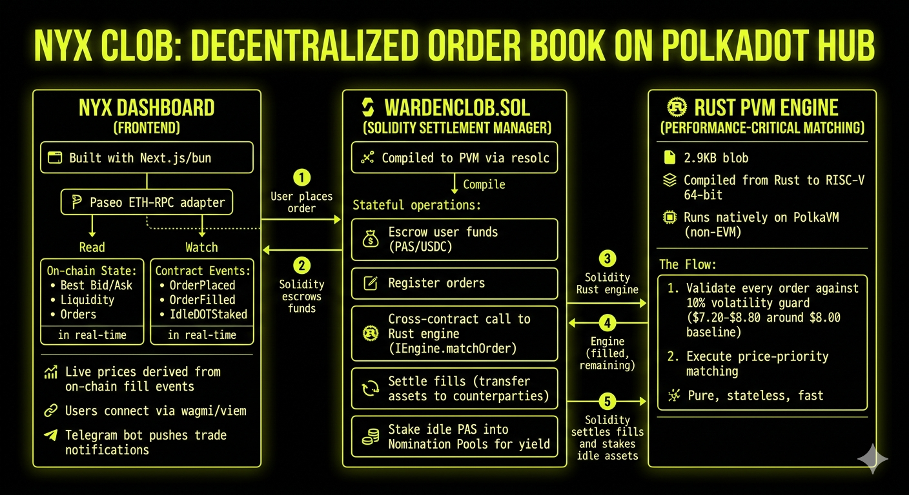

# Nyx CLOB

**Polkadot Hackathon — Track 2: Unlock the Speed and Power of PVM**

A fully on-chain Central Limit Order Book (CLOB) built on PolkaVM's RISC-V architecture, where Solidity calls into a native Rust matching engine via cross-runtime contract calls. Deployed and running on Paseo Asset Hub testnet.

**Live:** [nyx-trade.vercel.app](https://nyx-trade.vercel.app)

---

## Overview

Nyx is an implementation of PolkaVM's RISC-V architecture where it utilizes PVM for calling Rust contracts from a Solidity engine.

The heavy lifting — order matching and volatility guard — runs as a Rust binary compiled down to a 2.9KB PolkaVM blob. The settlement layer is Solidity. When a user places a limit order, the Solidity contract escrows their funds, then makes a cross-runtime call into the Rust engine to figure out if there's a match. If there is, settlement happens immediately on-chain.

Rust gives us the performance and safety for the matching logic — 14 tests covering partial fills, price band violations, and overflow protection. Solidity gives us the composability and familiar ERC20 integration for USDC escrow, DOT deposits, and automatic yield through nomination pool staking on idle capital.

This is not a demo with mock data. Everything is deployed and running on Paseo Asset Hub testnet.

---

## Features

### On-Chain CLOB
- Limit orders (buy/sell) against a live PAS/USDC order book
- Escrow-based settlement with immediate on-chain fills
- Volatility guard rejecting orders outside a +/-10% price band
- Idle capital automatically staked into Nomination Pools for yield

### Telegram Notifications
- Link your wallet to the [@nyx_polkabot](https://t.me/nyx_polkabot) Telegram bot
- Real-time alerts for OrderPlaced, OrderFilled, and OrderSettled events
- Persistent wallet-to-chat mapping survives server restarts

### Nyx Trading Dashboard
- Real-time order book, depth chart, and activity log from on-chain events
- Place orders directly via MetaMask (wagmi + viem)
- Portfolio view: balances, yield tracking, fill history
- All charts are pure SVG with no charting library dependencies
- Collapsible panels for Activity and Open Orders

---

## The PVM Stack

```
                        PolkaVM Runtime (RISC-V 64-bit)
                        ================================

  User tx                    Solidity (resolc)                Rust (polkavm)
  ------                     -----------------                --------------

  placeLimitOrder()  --->  WardenCLOB.sol                   engine/src/lib.rs
                           |                                      ^
                           | 1. Escrow funds                      |
                           | 2. IEngine.matchOrder() ------------+
                           |                                      |
                           | 3. Receive (filled, remaining) <-----+
                           | 4. Settle + stake idle DOT
```

### 1. Rust Engine ([`engine/src/lib.rs`](engine/src/lib.rs))

A `no_std` Rust program compiled to RISC-V 64-bit (`riscv64emac-unknown-none-polkavm`) and linked into a `.polkavm` blob by [`polkatool`](engine/Cargo.toml). It runs natively on PolkaVM — not inside an EVM interpreter.

**Entry points** exported via `#[polkavm_derive::polkavm_export]`:
- `deploy()` — no-op constructor
- `call()` — reads 164-byte ABI calldata, runs matching, returns 64-byte result

**Matching logic:**
- Decodes `matchOrder(uint8 side, uint256 price, uint256 qty, uint256 bestOppositePrice, uint256 availableLiquidity)`
- Runs a volatility guard: rejects orders outside a +/-10% band around a $8.00 DOT baseline
- Price-priority match: `filled = min(qty, availableLiquidity)` when price crosses the spread
- Returns `(filledAmount, remainingAmount)` ABI-encoded

**Testing:** 14 unit tests run on host (`cargo test`) — all PVM-specific code is `#[cfg(not(test))]` gated so the pure matching logic is testable without a PVM runtime.

### 2. Solidity to Rust Cross-Contract Call ([`contract/contracts/WardenCLOB.sol`](contract/contracts/WardenCLOB.sol))

Compiled to PVM bytecode via `resolc 0.3.0` (not `solc`). At order placement time, the Solidity contract makes a standard external call to the Rust engine via the [`IEngine`](contract/contracts/IEngine.sol) interface:

```solidity
// contract/contracts/IEngine.sol
(uint256 filled, uint256 remaining) = IEngine(engineAddress).matchOrder(
    side, price, quantity, bestOppositePrice, availableLiquidity
);
```

The PVM runtime routes this call to the Rust engine. It reads calldata via `HostFnImpl::call_data_copy()` and returns via `HostFnImpl::return_value()`. No special bridging — PVM's ABI is compatible with Solidity's external call encoding.

### 3. Native Asset and Precompiles

**USDC** ([`contract/contracts/MockUSDC.sol`](contract/contracts/MockUSDC.sol)) — Deployed as a standard ERC20 contract. WardenCLOB calls `transferFrom` to escrow buy collateral and `transfer` to pay out sellers.

**Staking (`0x0000...0804`)** — Nomination Pool precompile. After every order, idle DOT (balance minus locked sell collateral) is staked via `join(amount, poolId)` to earn passive yield.

### 4. Nyx Frontend ([`nyx/`](nyx/))

Real-time trading dashboard built with Next.js 16. Reads on-chain state via [`wagmi`](nyx/src/lib/wagmi.ts) and contract config from [`clob.ts`](nyx/src/lib/clob.ts). Telegram notifications via [`@nyx_polkabot`](nyx/src/lib/telegram.ts).

---

## Architecture



```
User / Nyx Frontend (Next.js 16)
        |
        v
 WardenCLOB.sol  (Solidity compiled to PVM via resolc)
  |  Escrow, settlement, yield, order book state
  |
  +---> IEngine.matchOrder(...)  ---------->  Rust PVM Engine  (engine/src/lib.rs)
  |                                            Volatility guard + price-priority match
  |                                            Returns (filledAmount, remainingAmount)
  |
  +---> USDC ERC20                             MockUSDC contract (6 decimals)
  +---> Staking Precompile  0x0000...0804      Nomination Pool join for idle DOT yield
        |
        v
  Telegram Bot (@nyx_polkabot)                 Real-time trade notifications
```

---

## Deployed Contracts — Paseo Asset Hub Testnet

| Contract | Address |
|---|---|
| **WardenCLOB** (Solidity) | [`0x504B962fC472ab5ea0C9CF58885f6f6ad6268BF3`](https://blockscout-paseo.polkadot.io/address/0x504B962fC472ab5ea0C9CF58885f6f6ad6268BF3) |
| **Rust PVM Engine** | [`0xCa1F96Ef99F21777C4DCe2Bc6C5BE88803625923`](https://blockscout-paseo.polkadot.io/address/0xCa1F96Ef99F21777C4DCe2Bc6C5BE88803625923) |
| **USDC** (ERC20) | [`0x2369B00a916132cBD3639bB29353d062f5fF325a`](https://blockscout-paseo.polkadot.io/address/0x2369B00a916132cBD3639bB29353d062f5fF325a) |
| Staking Precompile (Nom. Pools) | `0x0000000000000000000000000000000000000804` |

**Network:** Paseo Asset Hub Testnet
**RPC:** `https://eth-rpc-testnet.polkadot.io/`
**Deployer:** `0x445bf5fe58f2Fe5009eD79cFB1005703D68cbF85`
**Engine wired to WardenCLOB** via `setEngine()`

---

## Project Structure

```
polka/
├── engine/                     Rust PVM Matching Engine
│   ├── src/lib.rs              Matching logic, volatility guard, ABI decode/encode
│   ├── Cargo.toml              no_std cdylib — polkavm-derive 0.29.0, pallet-revive-uapi 0.10.1
│   └── engine.polkavm          Compiled blob (2.9 KB, blob version 0x00)
│
├── contract/                   Hardhat project — Solidity compiled to PVM via resolc
│   ├── contracts/
│   │   ├── WardenCLOB.sol      Settlement manager, escrow, yield, order book state
│   │   ├── IEngine.sol         Interface used by Solidity to call the Rust engine
│   │   └── MockUSDC.sol        ERC20 mock for USDC (6 decimals)
│   ├── scripts/deploy-all.ts   Deploy MockUSDC + WardenCLOB + Engine in one shot
│   └── scripts/deploy-engine.ts  Upload engine.polkavm blob + call setEngine()
│
├── nyx/                        Next.js 16 trading frontend (bun, Tailwind v4)
│   ├── src/app/dashboard/      Full trading dashboard (trade + portfolio modes)
│   ├── src/lib/clob.ts         Contract addresses, ABI, trading pairs config
│   ├── src/lib/telegram.ts     Telegram bot integration (persistent wallet linking)
│   ├── src/lib/wagmi.ts        Paseo Asset Hub chain config (chainId 420420421)
│   └── src/hooks/useTelegram.ts  Wallet-to-Telegram linking hook
│
├── seed-orders.ts              Seed bid/ask orders for order book population
├── build.sh                    Full build: cargo test -> resolc -> RISC-V cross-compile -> polkatool link
└── ARCHITECTURE.md             Deep-dive architecture and build documentation
```

---

## Build

### Prerequisites

| Tool | Version | Notes |
|---|---|---|
| Rust nightly | latest | `rustup install nightly` |
| polkatool | **0.29.0** | 0.30+ produces blob v2, rejected by testnet |
| resolc | 0.3.0 | Solidity to PVM compiler |
| Node.js | 18+ | for Hardhat |
| bun | latest | for nyx frontend |

> **Critical:** `polkatool` and `polkavm-derive` must be `0.29.0`. Newer versions produce blob version `0x02` which the Paseo testnet rejects with `CodeRejected`.

### Build Everything

```bash
./build.sh
```

This runs: `cargo test` (14 tests) -> `npx hardhat compile` (Solidity to PVM) -> RISC-V cross-compile -> `polkatool link` -> `engine.polkavm`

### Deploy

```bash
# Deploy MockUSDC + WardenCLOB + Engine in one go
cd contract && npx ts-node scripts/deploy-all.ts
```

### Frontend

```bash
cd nyx && bun install && bun run dev
```

### Telegram Bot

Set `TELEGRAM_BOT_TOKEN` in your environment. Users link wallets by clicking the Telegram button in the dashboard sidebar, which opens [@nyx_polkabot](https://t.me/nyx_polkabot) with their wallet address. Notifications fire for OrderPlaced, OrderFilled, and OrderSettled events.

---

## Key Technical Notes

- **PAS = 8 decimals** — `100_000_000 = 1 PAS` (`parseUnits(x, 8)`, display `/1e8`)
- **Gas estimates ~3x inflated** — normal for PVM; gas is capped at `500_000` in write calls
- **Integer arithmetic only** — all prices are 6-decimal fixed-point (`$8.00 = 8_000_000`)
- **Stateless engine** — no storage in Rust; Solidity is the single source of truth for book state
- **Bump allocator** — 64KB heap for `alloy-primitives`; never freed (PVM calls are ephemeral)
- **`-Z build-std` on CLI only** — not in `.cargo/config.toml`; breaks `cargo test` otherwise

For full architecture details, build troubleshooting, and test coverage: see [ARCHITECTURE.md](./ARCHITECTURE.md).
